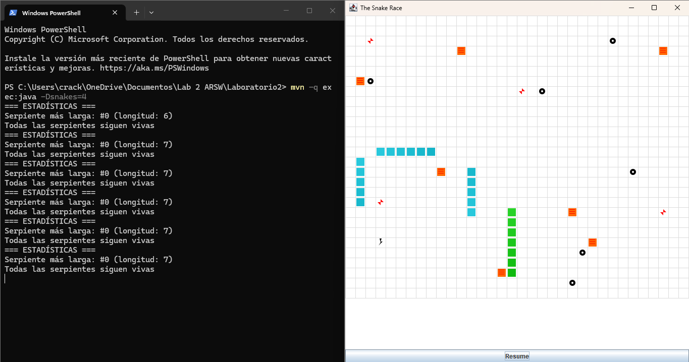
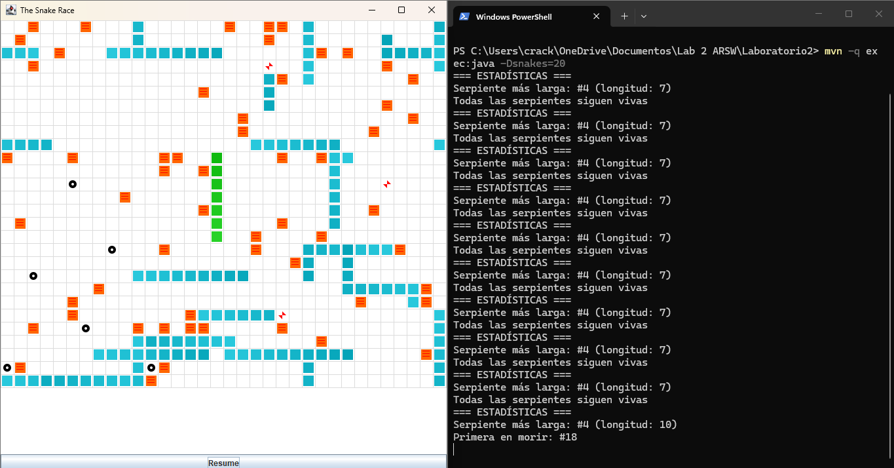

# Laboratorio 2 - ARSW: Programación Concurrente 

<div align="center">


</div>

**Escuela Colombiana de Ingeniería – Arquitecturas de Software**  
Laboratorio de programación concurrente: condiciones de carrera, sincronización y colecciones seguras.

---

## Tabla de Contenidos

- [Parte I - PrimeFinder](#parte-i---primefinder-con-waitnotify)
- [Parte II - Snake Race](#parte-ii---snake-race)
- [Ejecución](#ejecución)

---

## Parte I - PrimeFinder con wait/notify

### Descripción
Programa multi-hilo que busca números primos y se pausa automáticamente cada 5 segundos para mostrar el progreso.

### Diseño de Sincronización

**Monitor compartido**: Se utiliza un objeto `monitor` compartido entre la clase `Control` y todos los `PrimeFinderThread`.

**Mecanismo de pausa/reanudación**:
- Variable `volatile boolean paused` en cada hilo trabajador
- Los hilos verifican esta variable en cada iteración
- Cuando `paused == true`, el hilo ejecuta `monitor.wait()` (sin busy-waiting)
- `Control` usa `monitor.notifyAll()` para despertar todos los hilos

**Evitar lost wakeups**:
- Se usa un bucle `while(paused)` antes del `wait()` para verificar la condición
- Todos los hilos esperan en el mismo monitor
- `notifyAll()` despierta a todos los hilos simultáneamente

### Código clave

**PrimeFinderThread.java**:
```java
synchronized(monitor) {
    while(paused) {
        try {
            monitor.wait();
        } catch (InterruptedException e) {
            return;
        }
    }
}
```

**Control.java**:
```java
// Pausar todos los hilos
for(int i = 0; i < NTHREADS; i++) {
    pft[i].pauseThread();
}

// Mostrar progreso
int total = 0;
for(int i = 0; i < NTHREADS; i++) {
    total += pft[i].getPrimes().size();
}
System.out.println("Primos encontrados: " + total);

// Esperar ENTER
reader.readLine();

// Reanudar todos los hilos
synchronized(monitor) {
    for(int i = 0; i < NTHREADS; i++) {
        pft[i].resumeThread();
    }
    monitor.notifyAll();
}
```

### Ejecución

```bash
cd PrimeFinder
mvn clean compile exec:java
```

### Resultado de Ejecución


### Observaciones

1. **Sin busy-waiting**: Los hilos no consumen CPU mientras están pausados, gracias al uso de `wait()`
2. **Sincronización correcta**: El uso de `synchronized` y `notifyAll()` garantiza que todos los hilos se despierten
3. **Consistencia**: El conteo de primos es consistente porque cada hilo trabaja en un rango independiente
4. **Pausa no instantánea**: Los hilos terminan su iteración actual antes de pausarse, por lo que puede haber un pequeño desfase

---

## Parte II - Snake Race

### Arquitectura de Concurrencia

**Uso de hilos para autonomía:**
- Cada serpiente corre en su propio **virtual thread** (Java 21)
- Se usa `Executors.newVirtualThreadPerTaskExecutor()` para crear los hilos
- Cada `SnakeRunner` ejecuta un bucle infinito que mueve la serpiente automáticamente
- El `GameClock` controla el repintado de la UI en un hilo separado

### ⚠️ Problemas de Concurrencia Identificados y Soluciones

#### Race Condition en Snake
**Problema identificado:**
- `advance()` modifica `body` (ArrayDeque) desde hilos de serpientes
- `snapshot()` lee `body` desde el hilo de UI (repintado)
- ArrayDeque **no es thread-safe**
- **Riesgo**: `ConcurrentModificationException` o lecturas inconsistentes

**Solución implementada:**
```java
private final Object lock = new Object();

public void advance(Position newHead, boolean grow) {
    synchronized(lock) {
        body.addFirst(newHead);
        if (grow) maxLength++;
        while (body.size() > maxLength) body.removeLast();
    }
}

public Deque<Position> snapshot() {
    synchronized(lock) {
        return new ArrayDeque<>(body);
    }
}
```

**Justificación:**
- Lock privado para proteger solo `body`
- Región crítica mínima: solo las operaciones sobre la colección
- `snapshot()` crea una copia defensiva dentro del lock para evitar tearing

#### SnakeRunner no respetaba la pausa
**Problema identificado:**
- `GameClock.pause()` solo detenía el repintado
- Los hilos de serpientes seguían ejecutándose
- **Riesgo**: Inconsistencia entre lo mostrado y el estado real

**Solución implementada:**
```java
// En GameClock
public GameState getState() { return state.get(); }

// En SnakeRunner
while (clock.getState() != GameState.RUNNING) {
    Thread.sleep(50);
}
```

**Justificación:**
- Eliminada espera activa: se usa `Thread.sleep()` en lugar de busy-wait
- Los hilos consultan el estado del clock antes de cada movimiento
- Uso de `AtomicReference<GameState>` para lectura thread-safe sin locks

#### Detección de muerte de serpientes
**Problema identificado:**
- No había forma de rastrear qué serpiente murió primero
- No se podía determinar la serpiente más larga

**Solución implementada:**
```java
public final class SnakeStats {
  private final AtomicBoolean alive = new AtomicBoolean(true);
  private final AtomicLong deathTime = new AtomicLong(-1);
  
  public void markDead() {
    if (alive.compareAndSet(true, false)) {
      deathTime.set(System.currentTimeMillis());
    }
  }
}
```

**Lógica de muerte:**
- Si una serpiente choca con obstáculos más de 10 veces consecutivas, muere
- Se usa `AtomicBoolean` y `AtomicLong` para evitar sincronización explícita

### 🔒 Regiones Críticas Definidas

**1. Snake.body (ArrayDeque)**
- **Alcance**: Solo operaciones de lectura/escritura sobre `body`
- **Justificación**: Mínimo necesario para evitar corrupción de datos
- **Lock usado**: Objeto privado `lock` para evitar interferencia externa

**2. Board.step()**
- **Alcance**: Todo el método (ya estaba sincronizado)
- **Justificación**: Múltiples colecciones (mice, obstacles, turbo, teleports) se modifican atómicamente
- **Lock usado**: Monitor del objeto Board (synchronized method)

**3. GameClock.state**
- **Alcance**: Lectura/escritura del estado
- **Justificación**: Uso de `AtomicReference` elimina necesidad de sincronización explícita
- **Lock usado**: Ninguno (operaciones atómicas)

### Ejecución

```bash
mvn clean verify
mvn -q exec:java -Dsnakes=4
```

### Controles
- **Flechas**: Serpiente #0
- **WASD**: Serpiente #1
- **ESPACIO** o botón **Action**: Pausar/Reanudar

### Resultado al Pausar



### Prueba de Robustez

Ejecutado con **20 serpientes** sin errores:
```bash
mvn -q exec:java -Dsnakes=20
```


✅ Sin `ConcurrentModificationException`  
✅ Pausa/Reanudación funciona correctamente  
✅ Estadísticas consistentes  
✅ Teleports y turbo funcionan sin race conditions

---

## Autores

**Escuela Colombiana de Ingeniería Julio Garavito**  
- Arquitecturas de Software (ARSW)
- Carlos Mario Piedrahita Arango
