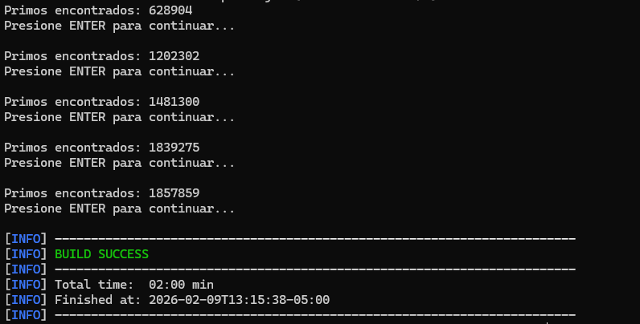

# Laboratorio 2 - ARSW: Programación Concurrente

**Escuela Colombiana de Ingeniería – Arquitecturas de Software**  
Laboratorio de programación concurrente: condiciones de carrera, sincronización y colecciones seguras.

---

## Parte I - PrimeFinder con wait/notify

### Descripción
Programa multi-hilo que busca números primos y se pausa automáticamente cada 5 segundos para mostrar el progreso.

### Diseño de Sincronización

**Monitor compartido**: Se utiliza un objeto `monitor` compartido entre la clase `Control` y todos los `PrimeFinderThread`.

**Mecanismo de pausa/reanudación**:
- Variable `volatile boolean paused` en cada hilo trabajador
- Los hilos verifican esta variable en cada iteración
- Cuando `paused == true`, el hilo ejecuta `monitor.wait()` (sin busy-waiting)
- `Control` usa `monitor.notifyAll()` para despertar todos los hilos

**Evitar lost wakeups**:
- Se usa un bucle `while(paused)` antes del `wait()` para verificar la condición
- Todos los hilos esperan en el mismo monitor
- `notifyAll()` despierta a todos los hilos simultáneamente

### Código clave

**PrimeFinderThread.java**:
```java
synchronized(monitor) {
    while(paused) {
        try {
            monitor.wait();
        } catch (InterruptedException e) {
            return;
        }
    }
}
```

**Control.java**:
```java
// Pausar todos los hilos
for(int i = 0; i < NTHREADS; i++) {
    pft[i].pauseThread();
}

// Mostrar progreso
int total = 0;
for(int i = 0; i < NTHREADS; i++) {
    total += pft[i].getPrimes().size();
}
System.out.println("Primos encontrados: " + total);

// Esperar ENTER
reader.readLine();

// Reanudar todos los hilos
synchronized(monitor) {
    for(int i = 0; i < NTHREADS; i++) {
        pft[i].resumeThread();
    }
    monitor.notifyAll();
}
```

### Ejecución

```bash
cd PrimeFinder
mvn clean compile exec:java
```

### Resultado de Ejecución



### Observaciones

1. **Sin busy-waiting**: Los hilos no consumen CPU mientras están pausados, gracias al uso de `wait()`
2. **Sincronización correcta**: El uso de `synchronized` y `notifyAll()` garantiza que todos los hilos se despierten
3. **Consistencia**: El conteo de primos es consistente porque cada hilo trabaja en un rango independiente
4. **Pausa no instantánea**: Los hilos terminan su iteración actual antes de pausarse, por lo que puede haber un pequeño desfase

---

## Parte II - Snake Race (En desarrollo)

### Ejecución

```bash
mvn clean verify
mvn -q -DskipTests exec:java -Dsnakes=4
```